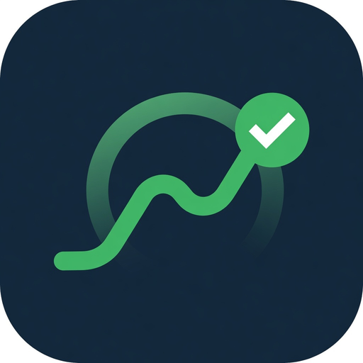

# Steady

**Evidence-based habit tracker for consistency, energy, focus, and longevity.**

Native Android app built with **Kotlin** and **Jetpack Compose**. Local-first: no accounts, no ads, no cloud lock-in.

<p align="center">
  
</p>

---

## What Steady is for

Steady helps you run a **daily routine** (sleep-anchored morning → focus → wind-down) and stay pointed at **longer-term goals** (Dreamline / Path). Log flexibly, see trends, get gentle reminders when a group starts, and keep a home-screen widget that shows *what to do right now*. Complex capabilities like overnight monitoring are surfaced the same way — as routine blocks you control.

---

## Design Philosophy: Special Habit Blocks & Extensions

**All features in Steady are (or will be) expressed as special habit blocks or extensions** that appear in the Today timeline and home widget. This is the unifying principle that keeps the app simple, cohesive, and true to its routine-centered design.

Instead of separate screens or background-only services, complex capabilities (overnight snoring detection, sensor sessions, timers, etc.) are modeled as schedulable blocks you place in your Daily Planner groups:

- **Evening / Bedtime Routine**: "Activate Snoring Recording" block
- **Morning Routine**: "Stop Snoring Recording & Review" block

Logging these blocks triggers the underlying rich behavior (start/stop services, analysis, summaries) while still participating fully in streaks, momentum scoring, reminders, widget visibility, and history.

**Benefits**:
- One mental model for the entire app
- Today + Widget become the complete daily command center
- Future features follow the exact same uniform pattern
- Maximum user control and intentionality (features are explicitly part of *your* routines)

See Manage → **Blocks** to add templates (sensor auto-read, screen usage, snore watch, ESM check-ins, Pomodoro) and architecture issue #33 for the full design.

---

## Features

### Today
- Timeline groups ordered by your **Daily Planner** (24h schedule)
- Current period highlighted; past / now / next sections
- Habit types: checkbox, counter, duration, scale, notes
- Multi-group habits, stacking (“after …”), skip when needed
- Quick capture inbox + workout session logger for exercise routines

### Path
- **Dreamline wizard** — Having / Being / Doing across 6- and 12-month horizons
- Goal cards with progress, confidence, first steps, and notes
- **“Am I on path?”** alignment check-ins (vision · energy · identity)
- Mindset anchors tied to Being goals

### History
- Streaks, weekly bars, Anki-style heatmap
- **Momentum** — Steady points, level, lifetime, 30-day points chart
- Tag-based trends (Supplements, Movement, Sleep, …)
- Workout session history

### Manage
Four focused sub-tabs:

| Sub-tab | What it does |
|--------|----------------|
| **Habits** | Flat catalog: create, edit, archive habits; **tags** for History; **exercise routines** |
| **Groups** | Timeline groups (Morning, Focus, Bedtime…); **attach existing habits**, order, move primary |
| **Blocks** | Special extensions: snore watch, sensor snapshot, screen usage, check-ins, Pomodoro, **local web UI** |
| **Planner** | Sleep spine + **24h timeline**, **reminders** (aligned to schedule), **backup** export |

### Momentum (scoring)
- **Steady points** for due habits completed today (base + target/quality bonuses)
- Day bonuses for solid days, full clears, and Path check-ins
- **Levels** from lifetime points (calm titles: Steady → Anchored → …)
- Shown on the Today header and History Momentum section

### Auto-log (sensors & external)
- Opt-in per habit: **Suggest** or **Auto-apply**
- **Screen time** (usage access) · **evening screen after wind-down**
- **Bedtime light** (lux) · dark-room check
- **Ambient noise** (mic, short samples)
- **Phone steps** (optional) · **Gadgetbridge / external steps** via broadcast
- Manage → Planner → Auto-log permissions; edit habit → Auto-log source

### Sleep audio / snore watch (Special habit block extension)
- **Implemented as special habit blocks** (see Design Philosophy / #33):
  - "Activate Snoring Recording" in **Evening / Bedtime**
  - "Stop & Review Night" in **Morning**
- Overnight recording, loud-event + snore heuristic detection, OGG/Opus segments, last-N-nights retention, charging gate unchanged
- Control and status via Today / widget; review nights from History
- Fully integrated with momentum, streaks, and routine reminders

### Sensor & screen extensions
- **Sensor Auto-Read** blocks: GPS (one-shot), steps, light/noise/screen snapshots linked to the log
- **Screen Usage** blocks: daily total + top-app breakdown (usage access)
- Snapshots stored locally and included in backup

### Widget & notifications
- Home-screen widget: current group, missed items, what’s next
- Exact alarms for group / daily-review reminders (reschedule on boot)
- **Smart & gentle**: adaptive timing from your log history, quiet hours, daily cap, streak-risk copy, skip empty groups
- **Daily motivational quotes** and **random awareness check-ins** (opt-in, Manage → Blocks / Planner)
- Per-habit reminders, missed-habit evening nudge, reminder strength
- Deep links from notifications and widget into the app
- Special extension blocks receive tailored status lines on Today

### Local web UI (LAN)
- Opt-in lightweight server on the phone (`Manage → Blocks`)
- Desktop browser on the same Wi‑Fi: **Today** (log/undo), **Habits** catalog (create/archive), capture, Pomodoro, 14-day history API
- Fully local — no cloud

### Appearance
- **Theme packs** inspired by Linux rice palettes: Nord, Catppuccin, Tokyo Night, Gruvbox, Dracula, Rosé Pine, Everforest, One Dark, OLED, Latte
- Compact accent swatches + custom HSV accent
- Guided tour + welcome guide from **Settings**

---

## Using Steady

1. **First run** — short onboarding; starter high-ROI habits are preloaded.
2. **Today** — tap to log; expand the header for weekly trends and per-group averages.
3. **Path** — run **Start Dreamline** to define dreams; check in with **Am I on path?**
4. **Manage → Planner** — set wake/bed, edit the 24h timeline, enable reminders.
5. **Manage → Habits / Groups** — catalog habits and timeline membership.
6. **Manage → Blocks** — add special extensions and enable LAN web / quotes / check-ins.
7. **Settings (gear)** — theme + help/tour.
7. **Backup** — Manage → Backup → Export / Import Backup (full JSON: habits, logs, Momentum, reminders, Path).

Tips:
- Grant **notifications** and **exact alarms** (Android 12+) for reliable reminders.
- Add the **Steady widget** from your launcher’s widget picker.
- Archive instead of delete so history stays intact.

---

## Build & run (CLI)

```bash
# Packages (Arch / Artix example)
sudo pacman -S --needed jdk17-openjdk unzip wget curl git

# One-time SDK setup
./scripts/setup-android-sdk.sh

# Debug APK
./build.sh clean assembleDebug
# → app/build/outputs/apk/debug/app-debug.apk

# Install on a connected device
./build.sh installDebug
```

Or with Gradle directly:

```bash
./gradlew assembleDebug
./gradlew testDebugUnitTest
```

---

## Project layout

```
app/src/main/java/com/steady/habittracker/
  data/          # models, HabitDomain (pure), repository / DataStore
  reminders/     # AlarmManager, BootReceiver, notifications
  ui/            # Compose screens (Today, Path, History, Manage, wizards)
  widget/        # App widget models + rendering
```

- **Schema** versioned JSON in DataStore (current schema v12: sleep-audio nights + auto-log).
- **Domain** logic is unit-tested under `app/src/test/`.

---

## Privacy

All data stays on device. No analytics SDKs, no accounts. Export is a local JSON backup you control.

---

## Portability

Core models (`Group`, `Habit`, `HabitEntry`, `Schedule`, `GoalStory`, `AppData`) and domain helpers are intentionally platform-light. Android-specific pieces (AlarmManager, widgets, DataStore) sit in Android modules so a KMP shared core can be extracted later.

---

## License / contribution

Open development on GitHub. Issues and PRs welcome for bugs, UX polish, and evidence-backed habit defaults.

---

<p align="center">
  <br/>
  <sub>Stay on path. Stay steady.</sub>
</p>
